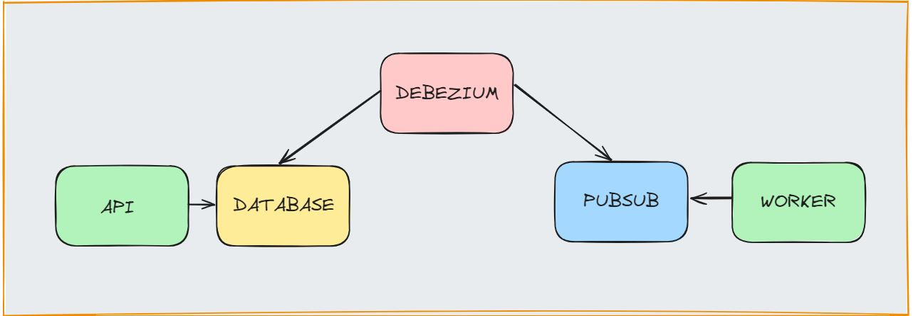

# Exemplo Debezium

Exemplo de debezium com pubsub e postgres para aplicação do outbox pattern

## Estrutura



- Debezium: Arquivo de configuração

- Postgres: Migrations para criação da tabela outbox

- App
    - Api: Api para criar registros na tabela outbox 

    - Worker: Worker para consumir os eventos do pubsub

- Pubsub: Utilização do pubsub emulator para questões de testes

## Requisitos
- [Docker + compose](https://rancherdesktop.io/)

## Instalação

Na raiz do projeto executar:

```sh
docker compose up
```

Irá iniciar:

- postgres na porta 5432 + migrations
    - db_user e db_password para usuário e senha
- pubsub emulator admin
    - Portal admin na porta 8003
    - Api do admin na porta 8085
    - Pubsub na porta 8432
- debezium server
    - Na porta 8088
- app
    - api para criar registros na outbox na porta 8009
    - worker para consumir registros do pubsub

Exemplo de POST:
```sh
curl -X POST http://localhost:8009/outbox
```

Exemplo de GET:
```sh
curl -X GET http://localhost:8009/outbox
```

Para verificar o envio da mensagem para o pubsub é necessário olhar os logs do container do worker

Ótima referência para aprendizado pode ser encontrada nesse [artigo](https://eskelsen.medium.com/aplicando-transactional-outbox-pattern-com-debezium-postgresql-e-gcp-pub-sub-para-eliminar-a4b9f858416c) brasileiro.


