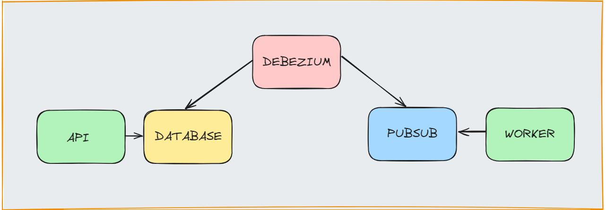

# Exemplo Debezium

Exemplo de debezium com pubsub e postgres para aplicação do [outbox pattern](https://microservices.io/patterns/data/transactional-outbox.html)

## Estrutura



- Debezium: Arquivo de configuração

- Postgres: Migrations para criação da tabela outbox

- App
    - Api: Api para criar registros na tabela outbox 

    - Worker: Worker para consumir os eventos do pubsub

- Pubsub: Utilização do pubsub emulator para questões de testes

## Requisitos
- [Docker + compose](https://rancherdesktop.io/)

## Instalação

Na raiz do projeto executar:

```sh
docker compose up
```

Irá iniciar:

- postgres na porta 5432 + migrations
    - db_user e db_password para usuário e senha
- pubsub emulator admin
    - Portal admin na porta 8003
    - Api do admin na porta 8085
    - Pubsub na porta 8432
- debezium server
    - Na porta 8088
- app
    - api para criar registros na outbox na porta 8009
    - worker para consumir registros do pubsub

Exemplo de POST:
```sh
curl -X POST http://localhost:8009/outbox
```

Exemplo de GET:
```sh
curl -X GET http://localhost:8009/outbox
```

Para verificar o envio da mensagem para o pubsub é necessário olhar os logs do container do worker

## Entendo o arquivo `application.properties`

```sh
# SINK: Destino
# Pubsub
debezium.sink.type=pubsub
# GCP project
debezium.sink.pubsub.project.id=test-project
# Usados apenas por conta do emulador. Em casos reais, seria usado um arquivo de autenticação para a GCP
debezium.sink.pubsub.address=pubsub:8432


# SOURCE: Fonte
debezium.source.connector.class=io.debezium.connector.postgresql.PostgresConnector
debezium.source.offset.storage.file.filename=data/offsets.dat
debezium.source.offset.flush.interval.ms=0
debezium.source.database.hostname=database
debezium.source.database.port=5432
debezium.source.database.user=db_user
debezium.source.database.password=db_password
debezium.source.database.dbname=sample-db
# Nome único pare representar essa fonte
debezium.source.topic.prefix=tutorial
# Tabela de origem para outbox
debezium.source.table.include.list=public.outbox
debezium.source.plugin.name=pgoutput
debezium.source.poll.interval.ms=1000

# TRANSFORMATIONS
debezium.transforms=outbox
debezium.transforms.outbox.type=io.debezium.transforms.outbox.EventRouter
debezium.transforms.outbox.table.expand.json.payload=true
# Sobrescreve o padrão de campo payload para o campo data
debezium.transforms.outbox.table.field.event.payload=data
# Sobrescreve de campo id para id
debezium.transforms.outbox.table.field.event.id=id
# Sobrescreve de aggregationid para id
debezium.transforms.outbox.table.field.event.key=id
# Sobrescreve de aggregationtype para type
debezium.transforms.outbox.route.by.field=type
value.converter=org.apache.kafka.connect.json.JsonConverter

# LOG LEVEL
quarkus.log.level=INFO
```

### OBS

O tópico de destino do pubsub será a combinação de: outbox.event.`aggregationType`

No caso, temos a sobrescrita do `aggregationType` pelo campo `type`. 

No exemplo, inserimos o valor `order` no campo `type`. Dessa forma, é preciso existir o tópico `outbox.event.order`

## Referências

- Ótima referência para aprendizado pode ser encontrada nesse [artigo](https://eskelsen.medium.com/aplicando-transactional-outbox-pattern-com-debezium-postgresql-e-gcp-pub-sub-para-eliminar-a4b9f858416c) brasileiro.

- [Outbox Event Roter](https://debezium.io/documentation/reference/stable/transformations/outbox-event-router.html)

- [Pubsub sink](https://debezium.io/documentation/reference/2.5/operations/debezium-server.html#_google_cloud_pubsub)

- [Connector](https://debezium.io/documentation/reference/stable/connectors/postgresql.html#postgresql-connector-properties)
